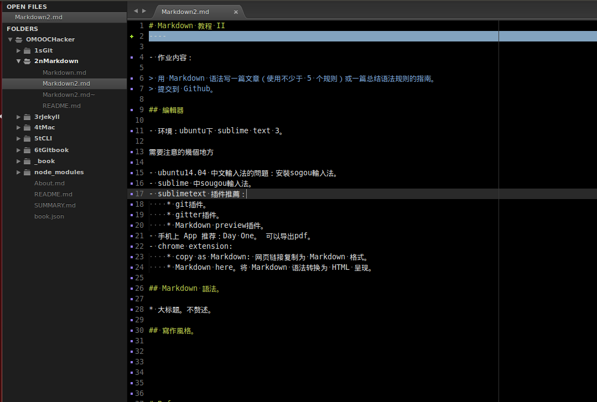

# Markdown 教程 II
----

- 作业内容：

> 用 Markdown 语法写一篇文章（使用不少于 5 个规则）或一篇总结语法规则的指南。
> 提交到 Github。

## 編輯器

- 环境：ubuntu下 sublime text 3。

<figure>
    
</figure>

需要注意的幾個地方

- ubuntu14.04 中文輸入法的問題：安裝sogou輸入法。
- sublime 中sougou輸入法。
- sublimetext 插件推薦：
    + git插件。
    + gitter插件。
    + Markdown preview插件。
        * ctrl-shift-P --> markdown preview --> preview.
- 手机上App推荐：Day One。可以导出pdf。
- chrome extension:
    + copy as Markdown: 网页链接复制为 Markdown 格式。
    + Markdown here。将 Markdown 语法转换为 HTML 呈现。

## Markdown 語法。

- 此处不赘述。参考[Markdown入门学习小结](http://www.jianshu.com/p/21d355525bdf#)。

## 寫作風格。

# Reference

- Markdown入门学习小结<http://www.jianshu.com/p/21d355525bdf>

- 理想的写作环境：Git+Github+Markdown+Jekyll<http://www.yangzhiping.com/tech/writing-space.html>
